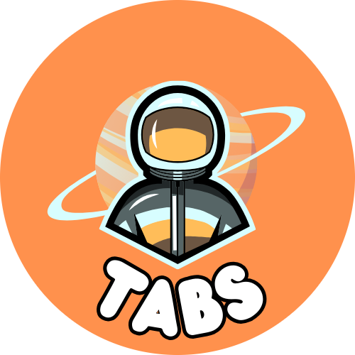
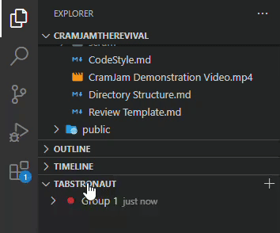
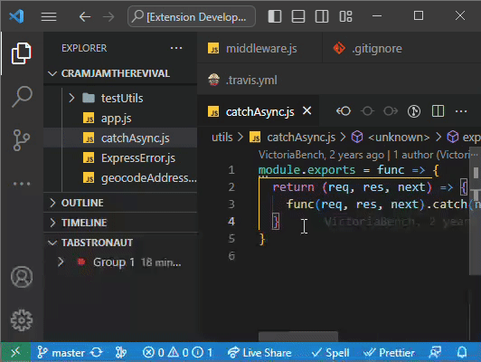

# Tabstronaut

<table>
  <tr>
    <td></td>
    <td valign="middle" style="padding-left: 20px;">A cosmic solution to group VS Code editor tabs 👩‍🚀🪐</td>
  </tr>
</table>

Tabstronaut excels in tab management for VS Code by enabling users to archive and retrieve specific tab groups. It ensures frequently-used or feature-specific tabs are systematically stored for future access.

## Features

The Tabstronaut extension offers these enhanced features:

- Creation of new groups from current tab or all tabs.
- Streamlined addition and removal of tabs within specific groups.
- Ability to open all tabs in a group or selectively expand/collapse them.
- Intuitive renaming and color-coding of groups.
- Efficient deletion of individual tabs or entire groups.
- Archive and retrieve tab sets, systematically storing frequently-used or feature-specific tabs for future access.
- Auto-close Other Tabs on Restore: A setting to close all currently open tabs before restoring a group for clean context switching.
- Improved Notebook Support: Tabs ending in `.ipynb` now restore properly using the Jupyter Notebook editor.
- Flexible Group Membership: A file can now belong to multiple tab groups without restriction.

## Tips

### Quick Access to Tabstronaut's Context Menu

You can quickly access the Tabstronaut's context menu without having to right-click. Simply press **`Ctrl+Alt+A`** on Windows/Linux or **`Cmd+Alt+A`** on macOS. You can also open this menu from the title bar of the Tabstronaut view, the right-click menu or the 'More Actions...' menu.

### Instantly Restore Tab Groups with Keybindings

Tabstronaut now supports keybindings to swiftly restore tab groups. Here's how to make the most out of them:

- **Restore the First Tab Group**: **`Ctrl+Alt+1`** (or **`Cmd+Alt+1`** on macOS)
- **Restore the Second Tab Group**: **`Ctrl+Alt+2`** (or **`Cmd+Alt+2`** on macOS)
- **Restore the Third Tab Group**: **`Ctrl+Alt+3`** (or **`Cmd+Alt+3`** on macOS)
- ... and so on, up to the ninth group with **`Ctrl+Alt+9`** (or **`Cmd+Alt+9`** on macOS).

### Customize Tabstronaut's location

You can move the Tabstronaut extension to many parts of the VS Code UI, such as the Sidebars and Panel.

### Close all tabs

You can close all tabs by clicking the 'close all editor tabs' button in the title bar of the Tabstronaut view, right-clicking any tab and clicking 'Close All' or pressing `Ctrl+K W`.

## Requirements

There are no specific requirements or dependencies for this extension.

## Extension Settings

To tailor Tabstronaut to your preferences:

1. Click the "..." (More Options...) button in the Tabstronaut title bar and click "Settings".

OR

1. Open **VS Code Settings**: **`Ctrl+Shift+P`** ➡️ "Preferences: Open Settings (UI)".
2. Search for "Tabstronaut".
3. Adjust the provided settings such as "Display file paths as Tab descriptions", "Set key bindings for restoring Tab Groups", "Move Group On Tab Change", and confirmation preferences.

Your changes will be saved automatically.

## Known Issues

There are no known issues at the moment. If you encounter a bug, please open an issue on the GitHub repository!

## Release Notes

For a detailed list of all updates in bullet point format, see our [Change Log](extension/CHANGELOG.md).

---

**Enjoy using Tabstronaut!** 🧑‍🚀🪐
