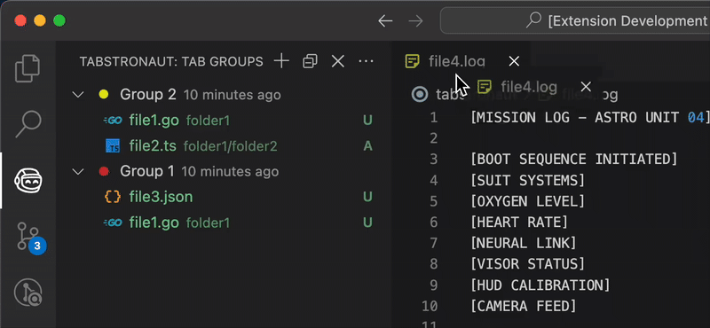

  

Tabstronaut excels in tab management for VS Code by enabling users to archive and retrieve specific tab groups. It ensures frequently-used or feature-specific tabs are systematically stored for future access.

## Support the creator

Love this extension? You can support its development with a small donation - completely optional! Your support helps me keep creating and improving tools like this.

## Features

- Create tab groups instantly
  - Collect your current or all open tabs into organized groups with a single click.
- Drag-and-drop mastery
  - Effortlessly reorder tabs or entire groups and give them colors or timestamps to keep everything tidy.
- Share and revisit your workspaces
  - Save tab groups for later, export them to share, or bring back archived sets whenever inspiration strikes.

## Tips

Check out [@tabstronaut_dev](https://x.com/tabstronaut_dev) for Tabstronaut tips and how-to videos.

### Quick Access to Tabstronaut's Context Menu

You can quickly access the Tabstronaut's context menu without having to right-click. Simply press **`Ctrl+Alt+A`** on Windows/Linux or **`Cmd+Alt+A`** on macOS. You can also open this menu from the title bar of the Tabstronaut view, the right-click menu or the 'More Actions...' menu.

### Instantly Restore Tab Groups with Keybindings

Tabstronaut now supports keybindings to restore tab groups. Here's how to make the most out of them:

- **Restore the First Tab Group**: **`Ctrl+Alt+1`** (or **`Cmd+Alt+1`** on macOS)
- **Restore the Second Tab Group**: **`Ctrl+Alt+2`** (or **`Cmd+Alt+2`** on macOS)
- ... and so on, up to the ninth group with **`Ctrl+Alt+9`** (or **`Cmd+Alt+9`** on macOS).

## Extension Settings

To tailor Tabstronaut to your preferences:

- Click the "..." (More Options...) button in the Tabstronaut title bar and click "Settings".

OR

- Open **VS Code Settings**: **`Ctrl+Shift+P`** → "Preferences: Open Settings (UI)" and search for "Tabstronaut".

Your changes will be saved automatically.

## Known Issues

If you encounter any other problem, please open an [Issue](https://github.com/jhhtaylor/tabstronaut/issues) on the GitHub repository.

## Release Notes

For a detailed list of all updates in bullet point format, see our [Change Log](CHANGELOG.md).
