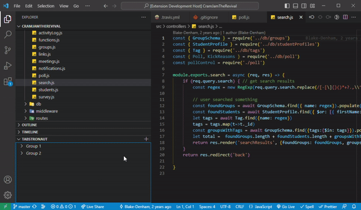

# Tabstronaut

<table>
  <tr>
    <td></td>
    <td valign="middle" style="padding-left: 20px;">A cosmic solution to group VS Code editor tabs 👩‍🚀🪐</td>
  </tr>
</table>

The Tabstronaut extension is a convenient tool that helps manage your workspace tabs into organized groups for efficient access. This extension is easy to use, and adds a new dimension of organization to your workspace in Visual Studio Code.

## Features

The Tabstronaut extension has the following features:

- Creation of new groups from current tab or all tabs.
- Adding tabs to a specific group.
- Ability to open all tabs in a group.
- Renaming of groups.
- Deletion of groups.

## Requirements

There are no specific requirements or dependencies for this extension.

## Extension Settings

The Tabstronaut extension does not currently add any new settings to VS Code.

## Known Issues

There are no known issues at the moment. If you encounter a bug, please open an issue on the GitHub repository!

## Release Notes

### 1.1.3

In this update, we added the ability to change the sort order of the Tab Groups.

### 1.1.2

In this update, we removed the "Invalid Tab Group name. Please try again." error message when the user cancels renaming a Tab Group.

### 1.1.1

In this update, we've enhanced Tabstronaut by ensuring groups are uniquely identified by IDs, allowing multiple groups with identical names. We've improved user prompts for the 'New Group from All Tabs...' option and fixed a bug to allow adding tabs to existing groups, streamlining your user experience.

### 1.1.0

In our latest update, we've removed the need for GitHub authentication and Postgres server connections, making Tabstronaut quicker and more straightforward to use. We've also tailored Tab Groups to be workspace-specific, improving organization and focus. Enjoy a streamlined, hassle-free coding experience with Tabstronaut!

### 1.0.0

Initial release of Tabstronaut.

---

**Enjoy using Tabstronaut!**
