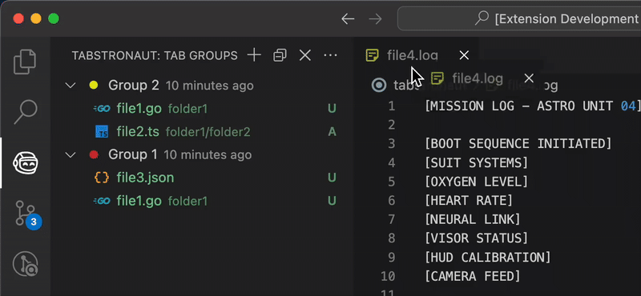

  

Tabstronaut excels in tab management for VS Code by enabling users to archive and retrieve specific tab groups. It ensures frequently-used or feature-specific tabs are systematically stored for future access.

## Support the creator

Love this extension? You can support its development with a small donation - completely optional! Your support helps me keep creating and improving tools like this.

## Features

- Create tab groups instantly
  - Collect your current or all open tabs into organized groups with a single click.
- Drag-and-drop mastery
  - Drag a group onto another group to reorder, onto a tab to nest it inside that group, or onto empty space to promote it to the top level.
- Share and revisit your workspaces
  - Save tab groups for later, export them to share, or bring back archived sets whenever inspiration strikes.
- Tab Snapshots
  - Save your entire split-editor layout — not just which files are open, but how they're arranged across columns — and restore it exactly as it was, in one click.

## Tab Snapshots

A **Tab Snapshot** is a special kind of Tab Group that remembers your whole editor layout: how many columns you had open, which files were in each column, and which tabs were pinned. Restoring it doesn't just reopen a list of files — it recreates the split layout itself.

### Creating a Tab Snapshot

1. Split your editor into two or more columns, arranged the way you want to save them.
2. Click **Create New Tab Snapshot** (the camera icon at the top of the Tabstronaut sidebar), or press `Ctrl+Alt+S` / `Cmd+Alt+S`.
3. Name it (or accept the suggested name) and it's saved.

If you have fewer than 2 columns open, Tabstronaut will ask you to split your editor first — a Tab Snapshot only makes sense for multi-column layouts. If you just want to save the current (single-column) set of tabs as a regular group, use the normal **Add All Open Tabs to Group** flow instead.

### Restoring a Tab Snapshot

Restore a Tab Snapshot the same way you'd restore any Tab Group — click it in the sidebar, or use `Ctrl+Alt+O` / `Cmd+Alt+O`, `Ctrl+Alt+Enter` / `Cmd+Alt+Enter`, or the `Ctrl+Alt+1`–`9` group-number shortcuts. Tabstronaut closes your current editors (including pinned tabs) and recreates the saved columns, reopening each file — pinned again if it was pinned — in its original position.

### Updating a Tab Snapshot

Rearranged your editors and want to save the new layout under the same Tab Snapshot? Select it in the sidebar and either click its **Update Tab Snapshot** button (camera icon) or press `Ctrl+Alt+Shift+S` / `Cmd+Alt+Shift+S`. This replaces the saved columns and files with your current layout.

If you update a Tab Snapshot while only a single editor column is open, it's converted back into a regular Tab Group containing that column's files — its square icon and "(Tab Snapshot)" tooltip are removed.

### How to tell a Tab Snapshot apart from a regular group

Tab Snapshots use a square icon (regular groups use a circle) and show "(Tab Snapshot)" in their tooltip. Their column sub-groups are managed automatically — they're restored, renamed, and removed as part of the Tab Snapshot itself, so they don't appear in the usual "Add to Tab Group" pickers.

Tab Snapshots are only ever created or updated explicitly, via **Create New Tab Snapshot** / **Update Tab Snapshot** (or `Ctrl+Alt+S` / `Ctrl+Alt+Shift+S`). **Add All Open Tabs to Group** (`Ctrl+Alt+G`) and **New Tab Group from all tabs...** always create a normal flat group, regardless of how many editor columns are open.

## Tips

Check out [@tabstronaut_dev](https://x.com/tabstronaut_dev) for Tabstronaut tips and how-to videos.

### Keyboard Shortcuts

Every Tabstronaut action has a keyboard shortcut so you never need to touch the mouse.

| Action | Windows / Linux | macOS |
|--------|----------------|-------|
| **Create a new empty group** | `Ctrl+Alt+N` | `Cmd+Alt+N` |
| **Add current tab to a group** *(only shows groups the file isn't already in)* | `Ctrl+Alt+A` | `Cmd+Alt+A` |
| **Add all open tabs to a group** | `Ctrl+Alt+G` | `Cmd+Alt+G` |
| **Add current split's tabs to a group** | `Ctrl+Alt+Shift+G` | `Cmd+Alt+Shift+G` |
| **Create a new Tab Snapshot from the current split layout** | `Ctrl+Alt+S` | `Cmd+Alt+S` |
| **Update the focused Tab Snapshot** *(sidebar must have focus)* | `Ctrl+Alt+Shift+S` | `Cmd+Alt+Shift+S` |
| **Open / restore a group** | `Ctrl+Alt+O` | `Cmd+Alt+O` |
| **Rename a group** | `Ctrl+Alt+E` | `Cmd+Alt+E` |
| **Rename focused group** *(sidebar must have focus)* | `F2` | `F2` |
| **Delete focused group** *(sidebar must have focus)* | `Delete` | `⌫ Delete` |
| **Restore focused group** *(sidebar must have focus)* | `Ctrl+Alt+Enter` | `Cmd+Alt+Enter` |
| **Remove current tab from a group** | `Ctrl+Alt+R` | `Cmd+Alt+R` |
| **Delete a group** | `Ctrl+Alt+Shift+R` | `Cmd+Alt+Shift+R` |
| **Restore group 1–9 by number** | `Ctrl+Alt+1` – `Ctrl+Alt+9` | `Cmd+Alt+1` – `Cmd+Alt+9` |

The letter shortcuts (**A**, **G**, **Shift+G**, **O**, **E**, **R**, **Shift+R**) open a quick-pick menu — start typing to filter the list. **N** silently creates a group with no menu when the *Prompt for Group Details* setting is off (the default). The number shortcuts restore a top-level group immediately without any menu. **F2**, **Delete** (⌫ on Mac), **Ctrl+Alt+Enter**, and **Ctrl+Alt+Shift+S** work when a group is selected in the Tabstronaut sidebar — navigate with arrow keys, then press F2 to rename, Delete/⌫ to delete, Ctrl+Alt+Enter to restore in place, or Ctrl+Alt+Shift+S to update a selected Tab Snapshot with your current layout. **Ctrl+Alt+S** requires at least 2 editor columns to be open and saves that layout as a brand new Tab Snapshot, prompting for a name.

> **Tip:** All of these can also be reached from the Tabstronaut sidebar, the right-click menu in the editor tab bar, or the Command Palette (`Ctrl+Shift+P` / `Cmd+Shift+P`).

## Extension Settings

To tailor Tabstronaut to your preferences:

- Click the "..." (More Options...) button in the Tabstronaut title bar and click "Settings".

OR

- Open **VS Code Settings**: **`Ctrl+Shift+P`** → "Preferences: Open Settings (UI)" and search for "Tabstronaut".

Your changes will be saved automatically.

## Privacy

Tabstronaut includes a tab group suggestion feature that learns which files you tend to open together. Here is exactly what it does and does not do.

**What is always true regardless of AI:**

- **What is tracked:** The file paths of tabs you have open in VS Code, and how often those files appear open at the same time.
- **Where it is stored:** Entirely on your local machine, inside VS Code's built-in workspace storage (`workspaceState`).
- **File contents are never read** under any circumstances.

You can clear all tracked data at any time by running **Tabstronaut: Clear Tab Usage Data** from the command palette.

**AI-powered naming (optional):**

If you have a VS Code language model provider installed (such as GitHub Copilot), Tabstronaut will use it to generate a better group name. In that case:

- **What is sent:** Only the bare **file names** of the suggested files (e.g. `Button.tsx, Input.tsx`) — never full paths, never file contents.
- **Where it goes:** To whichever language model provider you have enabled in VS Code. For GitHub Copilot this means Microsoft's servers, subject to your existing Copilot agreement.

The suggestion item shows a **sparkle icon** when AI naming is active, and a **lightbulb icon** when using the local heuristic only.

**Settings:**

Both features can be controlled independently in VS Code Settings (search for "Tabstronaut"):

- **Enable Tab Group Suggestions** — master switch. Turn this off to disable all usage tracking and suggestions entirely.
- **Enable AI Group Naming** — turn this off to keep suggestions but use only the local heuristic for naming. No data will leave your device.

## Known Issues

If you encounter any other problem, please open an [Issue](https://github.com/jhhtaylor/tabstronaut/issues) on the GitHub repository.

## Release Notes

For a detailed list of all updates in bullet point format, see our [Change Log](CHANGELOG.md).
